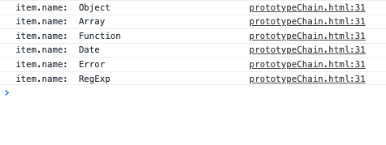

# 原型链

[[toc]]

[继承与原型链](https://developer.mozilla.org/zh-CN/docs/Web/JavaScript/Inheritance_and_the_prototype_chain)

1. **所有引用类型对象，都有一个`__proto__`属性指向创建该对象原型对象的`prototype`对象**
2. **所有引用类型对象，最终指向`Object.prototype`，`Object.__proto__` 指向 `null`**

```js
// 所有引用类型对象，都有一个__proto__属性指向创建该对象原型对象的prototype对象
const obj = {};
// Object 的实例原型链  __proto__ 指向 Object.prototype ,
//Object.prototype.__proto__指向 null
const flag = obj.__proto__ == Object.prototype
console.log('flag: ', flag); // true 
const arr = [];
// Array 的原型链  __proto__ 指向 Array.prototype，
//Array.prototype.__proto__ 指向 Object.prototype ,
//,Object.prototype.__proto__指向 null
const arrFlag = arr.__proto__ == Array.prototype;
console.log('arrFlag: ', arrFlag);
// Array.prototype.__proto__ == Object.prototype 
console.log(
  'Array.prototype.__proto__ == Object.prototype : ', 
  Array.prototype.__proto__ == Object.prototype 
); //ture
console.log(
  'Array.prototype.__proto__.__proto__ == null: ',
  Array.prototype.__proto__.__proto__ == null
); // true
```

3. **`Object`, `Array`, `Function`, `Date`, `Error`, `RegExp` 的原型对象上的属性和方法不可枚举**

   ```js
   const list = [Object, Array, Function, Date, Error, RegExp];
   list.forEach(item => {
     console.log('item.name: ', item.name);
     for (let key in item.prototype) {
       console.log('key: ', key);
     }
   })
   ```

   

j