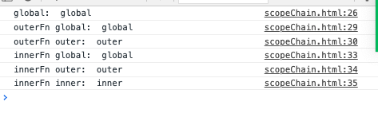

# 作用域链

[[toc]]

> 作用域，js作用域为函数作用域。函数外部无法访问函数内部的变量。函数内部可以访问函数外部的变量

[闭包](https://developer.mozilla.org/zh-CN/docs/Web/JavaScript/Closures)

```js
let outer = 'outer';
function scope (){
  let inner = 'inner';
  console.log('outer: ', outer); //outer
}
scope();
console.log('inner: ', inner); // error is not defined
```

```js
let global = 'global';
console.log('global: ', global);
function outerFn() {
  let outer = 'outer';
  console.log('outerFn global: ', global);
  console.log('outerFn outer: ', outer);
  function innerFn() {
    let inner = 'inner';
    console.log('innerFn global: ', global);
    console.log('innerFn outer: ', outer);
    console.log('innerFn inner: ', inner);
  }
  innerFn()
}
outerFn()
```



